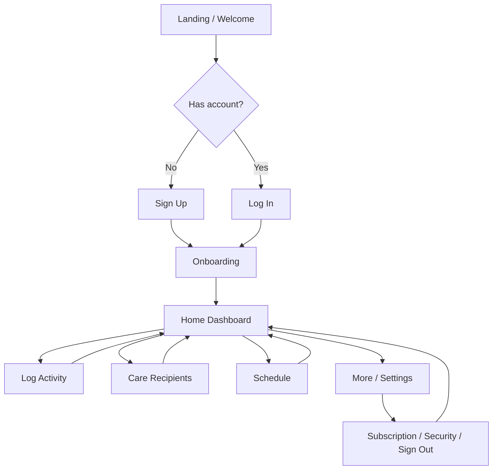

# Nurtura App Flow & Screen Walkthrough

## User Story
As a caregiver, I want to sign in, set up my care profile, add recipients, log daily care, manage schedules, and access settings so I can coordinate care with less friction and greater confidence.

## Suggested Notion Page Structure
1. Overview
2. User Story
3. Screen-by-screen walkthrough
4. Flow chart
5. Screenshot gallery

## Screen-by-Screen Walkthrough

### 1. Landing / Welcome
- Purpose: Introduce the product and guide new users to sign up or log in.
- Key actions: Start Free, Log In.
- Screenshot: [01-landing.png](screenshots/01-landing.png)

### 2. Sign Up
- Purpose: Create a caregiver account.
- Key actions: Enter name, email, password, create account.
- Screenshot: [auth-signup.png](screenshots/auth-signup.png)

### 3. Log In
- Purpose: Return users can access their existing account quickly.
- Key actions: Email, password, sign in.
- Screenshot: [auth-login.png](screenshots/auth-login.png)

### 4. Onboarding
- Purpose: Capture caregiver role, accessibility preferences, care recipient details, and health context.
- Key actions: Select role, answer intake questions, finish onboarding.
- Screenshot: [onboarding.png](screenshots/onboarding.png)

### 5. Home Dashboard
- Purpose: Provide an at-a-glance overview of care status and next actions.
- Key actions: View today's completion rate, quick actions, recent activity, recipients, schedule.
- Screenshot: [home.png](screenshots/home.png)

### 6. Log Activity
- Purpose: Allow fast care logging for tasks, vitals, meals, activity, mood, or notes.
- Key actions: Choose recipient, select type, enter title and notes, save entry.
- Screenshot: [tabs-log.png](screenshots/tabs-log.png)

### 7. Care Recipients
- Purpose: Manage the people being cared for and their profile details.
- Key actions: Add recipient, choose avatar, set care type, add notes.
- Screenshot: [tabs-recipients.png](screenshots/tabs-recipients.png)

### 8. Schedule
- Purpose: View and manage planned care items by date.
- Key actions: Select day, add/edit/delete schedule items, unlock recurring schedules as a premium feature.
- Screenshot: [tabs-schedule.png](screenshots/tabs-schedule.png)

### 9. More / Settings
- Purpose: Access deeper app features and account controls.
- Key actions: Open medications, messages, time tracking, subscription, security, integrations, sign out.
- Screenshot: [tabs-more.png](screenshots/tabs-more.png)

## Flow Chart

## Optional Notion Copy
- Primary user: caregiver or family organizer
- Core job to be done: keep care coordination simple and reliable
- Main success outcome: reduced missed tasks and better visibility into care progress

## Screenshot Gallery
- [Landing](screenshots/01-landing.png)
- [Sign Up](screenshots/auth-signup.png)
- [Log In](screenshots/auth-login.png)
- [Onboarding](screenshots/onboarding.png)
- [Home Dashboard](screenshots/home.png)
- [Log Activity](screenshots/tabs-log.png)
- [Care Recipients](screenshots/tabs-recipients.png)
- [Schedule](screenshots/tabs-schedule.png)
- [More / Settings](screenshots/tabs-more.png)
