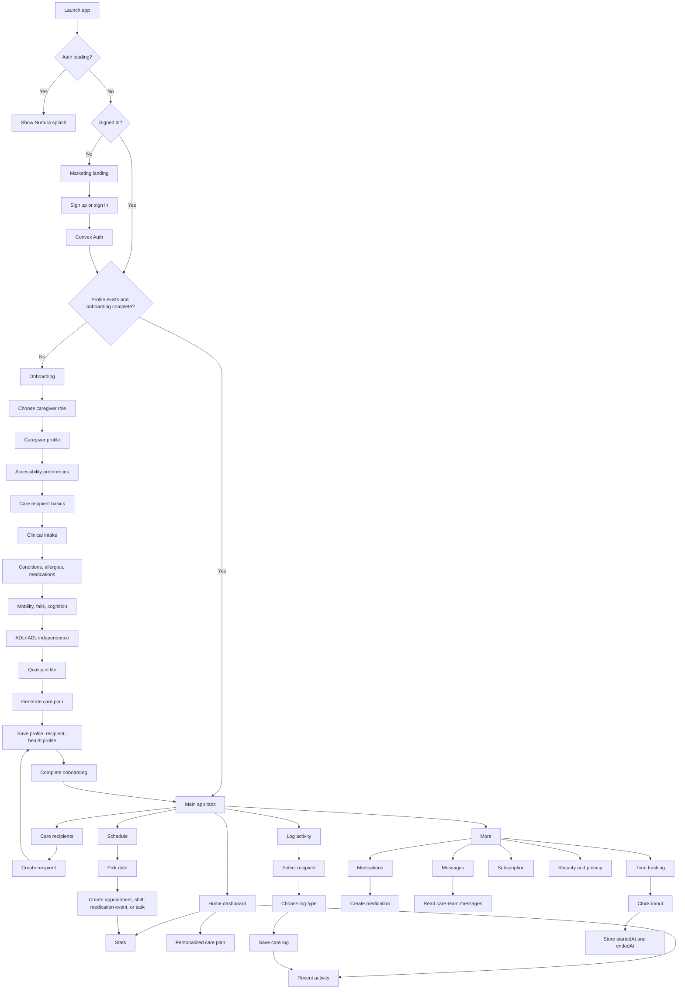

# Nurtura Full Process Flow

## Data Flow Summary

1. The client authenticates with Convex Auth.
2. Convex derives the current user server-side.
3. Care-recipient data is accessed through care-team membership.
4. Onboarding writes profile, recipient, and health profile data.
5. The care-plan engine turns structured intake into a deterministic plan.
6. Main tabs read and write care data through Convex queries and mutations.
