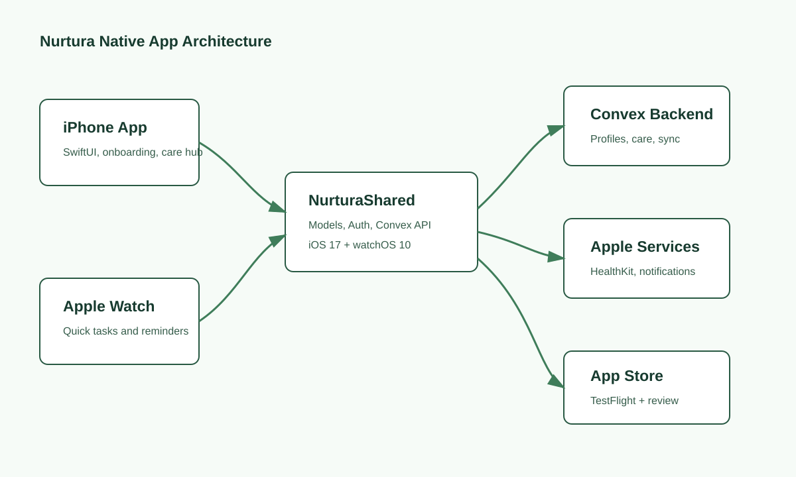

# Nurtura Product Brief

## Positioning
Nurtura helps families, care recipients, and professional caregivers coordinate
daily care with medication tracking, schedules, messages, care logs, accessibility
settings, and Apple Watch quick actions.

## Current Native App Shape

The local Swift package shows:
- iOS 17 target
- watchOS 10 target support
- Shared model/API package named `NurturaShared`
- Convex backend integration
- OAuth-style authentication
- Keychain token storage
- Care recipient management
- Medication tracking
- Schedule entries
- Messages and Ivy chat assistant
- Time tracking
- Subscription tiers
- Data export and account deletion hooks
- Watch sync endpoint: `api/watch/sync`

## Audience Segments

| Segment | Need | Primary Message |
| --- | --- | --- |
| Family caregivers | Coordinate care without scattered texts and notes | Keep daily care organized in one gentle place |
| Care recipients | Stay informed without complex navigation | See what matters, with accessible settings |
| Professional caregivers | Track visits, tasks, notes, and time | Document care clearly and save admin time |
| Adult children of aging parents | Reduce uncertainty and missed tasks | Know what happened today without chasing updates |

## Core Promise
Nurtura makes care coordination calmer, clearer, and easier to share across the
people who care.

## Healthcare Claim Boundary
Nurtura should be positioned as care coordination and wellness support unless
the product obtains legal/regulatory review for stronger medical claims.

Use:
- Care coordination
- Medication reminders
- Care logs
- Schedule support
- Family communication
- Accessibility-friendly planning

Avoid unless reviewed:
- Diagnosis
- Treatment recommendations
- Clinical decision support
- Guaranteed medication adherence
- Claims that the app prevents medical harm
- Claims that Apple Watch vitals are medical-grade inside Nurtura

## Watch App Value
The Watch app should be presented as a quick companion:
- View upcoming care tasks
- See medication reminders
- Mark basic task state where appropriate
- Surface today’s schedule
- Sync core care data from iPhone/backend

The Watch app should not be marketed as an emergency medical device or continuous
patient monitoring service unless the product is specifically built, validated,
and cleared for that role.

