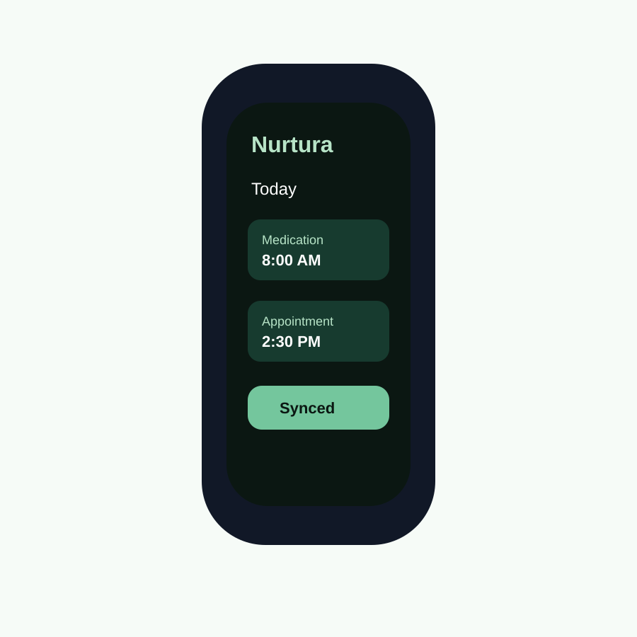

# Nurtura iOS And Watch Implementation Guide

## Goal
Prepare Nurtura as a production-ready iOS app with a companion Apple Watch app
and App Store-ready metadata, privacy disclosures, screenshots, and QA evidence.

## Repository Facts

```text
Package.swift
Nurtura/
  Models/
  Services/
  Views/
NurturaTests/
NurturaWatch/
Documentation/
```

The package currently defines `NurturaShared`, which includes models and service
code. The app entry point uses `NurturaApp.swift`, `RootView`, onboarding, auth,
HealthKit authorization, notifications, and Watch Connectivity calls.

## Implementation Checklist

### Xcode Project And Targets
- [ ] Confirm there is an Xcode app project or workspace wrapping this Swift package.
- [ ] Confirm iOS app target has bundle ID, signing team, app icon, launch screen, entitlements, and capabilities.
- [ ] Confirm Watch app target exists in Xcode, not only the folder structure.
- [ ] Confirm Watch extension target embeds correctly in the iOS app.
- [ ] Confirm shared models are imported into both iOS and watchOS targets.
- [ ] Confirm minimum deployment versions align with `Package.swift`: iOS 17 and watchOS 10.

### Capabilities
- [ ] Keychain sharing if needed across app/watch.
- [ ] Push notifications.
- [ ] HealthKit only if the app truly reads/writes HealthKit data.
- [ ] Background modes only if justified.
- [ ] Watch Connectivity.
- [ ] Associated domains only if using universal links.

### Backend
- [ ] Confirm production Convex URL.
- [ ] Confirm auth endpoints return camelCase token keys, or update `AuthManager` decoding.
- [ ] Confirm `api/watch/sync` returns medications, schedule entries, and care recipients.
- [ ] Confirm export and delete account endpoints work for App Store privacy expectations.
- [ ] Confirm backend logs do not store sensitive tokens or unnecessary health details.

### HealthKit
The code calls `HealthKitManager.shared.requestAuthorization()` at launch. Before
submission:
- [ ] Confirm `HealthKitManager` exists in the app target.
- [ ] Request only the specific HealthKit types Nurtura needs.
- [ ] Add human-readable purpose strings in `Info.plist`.
- [ ] Do not request HealthKit permission before the user understands why.
- [ ] Do not use HealthKit data for ads, marketing, or data mining.

### Notifications
- [ ] Add notification purpose strings where needed.
- [ ] Request notification permission after onboarding context, not before value is clear.
- [ ] Test medication reminders on real devices.
- [ ] Test notification behavior on Apple Watch.

### Accessibility
Nurtura already has accessibility-oriented models:
- Text size
- High contrast
- Simplified navigation
- Reduced motion

Before release:
- [ ] Test Dynamic Type through accessibility sizes.
- [ ] Test VoiceOver labels and reading order.
- [ ] Test high contrast appearance.
- [ ] Test reduced motion.
- [ ] Test one-handed use and caregiver-in-a-hurry flows.

## Watch App Readiness



Minimum Watch launch scope:
- Today’s care tasks
- Next medication/reminder
- Quick "done/snooze" interaction if backend supports it
- Offline/poor-connectivity fallback text
- Clear sync timestamp

Watch QA:
- [ ] Install iOS app and Watch app through TestFlight.
- [ ] Pair with a real Apple Watch.
- [ ] Validate first sync.
- [ ] Validate no stale care recipient data appears after sign out.
- [ ] Validate Watch app respects privacy on wrist.
- [ ] Validate complications/widgets only show non-sensitive info unless user opts in.

## Release Blockers
- Missing privacy policy URL.
- Missing support URL.
- Missing account deletion path.
- HealthKit permission requested without a clear reason.
- Medication/dosage claims that sound clinical rather than organizational.
- Watch app target not embedded in the iOS app archive.
- App Store privacy answers not matching actual SDKs and backend data use.

