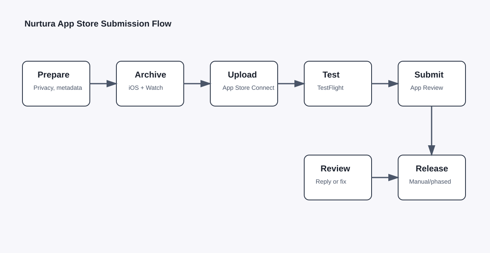
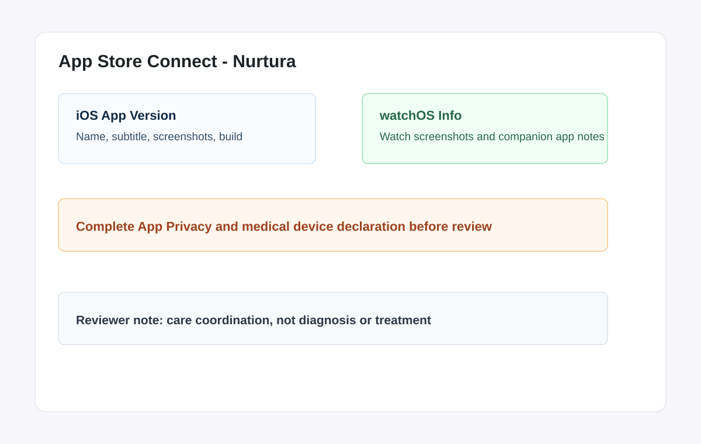
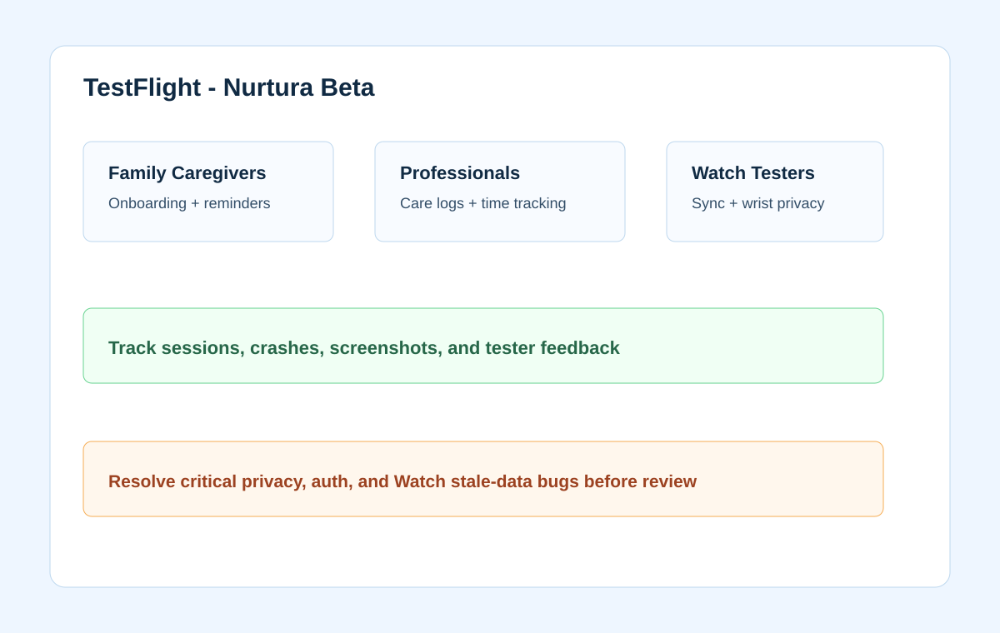

# Nurtura App Store Submission Guide



## Submission Goal
Submit Nurtura as an iOS app with a companion watchOS app, accurate privacy
nutrition labels, healthcare-safe claims, and a clean TestFlight trail.

## App Store Connect Setup

1. Enroll in the Apple Developer Program.
2. Create bundle IDs:
   - iOS app: `com.bonairapps.nurtura`
   - Watch app: `com.bonairapps.nurtura.watchkitapp`
   - Watch extension if applicable: `com.bonairapps.nurtura.watchkitapp.watchkitextension`
3. Create the app record in App Store Connect.
4. Add iOS platform information.
5. Add watchOS app information if the Watch app is distributed with the app.
6. Set category:
   - Primary: Health & Fitness or Medical, depending final positioning.
   - Recommendation: Health & Fitness if Nurtura remains coordination/wellness support and not a regulated medical device.
7. Add support URL and privacy policy URL.



## Metadata Draft

App name:

```text
Nurtura
```

Subtitle:

```text
Care coordination for families
```

Promotional text:

```text
Coordinate care tasks, medications, schedules, and updates with a calmer shared care hub for iPhone and Apple Watch.
```

Short description:

```text
Nurtura helps families and caregivers organize daily care with shared recipients, medication reminders, care logs, schedules, messages, and Apple Watch quick views.
```

Keywords:

```text
caregiver,care,medication,elder care,family care,care plan,reminders,watch,senior,home care
```

Review notes:

```text
Nurtura is a care coordination and wellness support app. It is not intended to diagnose, treat, cure, mitigate, or prevent disease. Demo account credentials are provided below. All demo data is fictional.
```

## Privacy And Health Disclosures

Prepare answers for App Privacy:
- Contact info: email, name if collected.
- Health and fitness: medications, care notes, conditions, vitals if collected.
- User content: messages and notes.
- Identifiers: user ID.
- Purchases: subscription tier if using in-app purchase.
- Diagnostics: crash logs if collected.

State clearly:
- What data is collected.
- Whether data is linked to the user.
- Whether data is used for tracking.
- Whether third-party SDKs receive data.
- How users delete/export account data.

For Nurtura, default recommendation:
- Do not use health data for third-party advertising.
- Do not share health data with ad networks.
- Keep analytics free of medication names, diagnoses, care notes, emergency contacts, and message content.

## Medical Device Status

Apple has a regulated medical device declaration area in App Store Connect.
Before submission, decide with legal/regulatory review:

- If Nurtura only coordinates care, reminders, logs, and messages, likely answer as not a regulated medical device.
- If Nurtura diagnoses, treats, makes dosage recommendations, interprets vitals clinically, or alerts as a patient monitor, get regulatory review before answering.

Include a disclaimer in the app and review notes:

```text
Nurtura is not a substitute for professional medical advice, diagnosis, or treatment. Users should consult a qualified clinician before making medical decisions.
```

## Screenshots And Previews

Required screenshot set to prepare:
- iPhone 6.7-inch
- iPhone 6.5-inch or 6.9-inch depending current App Store Connect requirements
- Apple Watch screenshots

Suggested screenshot story:
1. Dashboard: "Today’s care, clearly organized"
2. Care recipient: "Keep each person’s plan in one place"
3. Medication reminders: "Track medication routines"
4. Schedule: "Coordinate appointments and shifts"
5. Messages/Ivy: "Share updates with the care team"
6. Watch app: "Quick care views from your wrist"

Use fictional data only:
- Names: Eleanor Park, Sam Rivera, Maya Chen
- Medication examples: use generic fictional/demo data, avoid implying medical advice.

## Build And Upload

1. In Xcode, select `Any iOS Device`.
2. Product > Archive.
3. Validate archive.
4. Distribute App > App Store Connect.
5. Upload build.
6. Wait for processing.
7. Add build to TestFlight.
8. Add build to App Store version.

## TestFlight Before Review



1. Add internal testers.
2. Add external tester groups.
3. Provide beta review information.
4. Test iOS and watchOS install paths.
5. Collect feedback and fix blockers.
6. Expire old builds when no longer needed.

## Submit For Review

Apple’s submission overview says the review process covers every version of the
app and its content to ensure a safe and trustworthy experience. App versions
for each platform are submitted separately.

Final submission checklist:
- [ ] Build selected.
- [ ] Screenshots uploaded.
- [ ] App icon uploaded.
- [ ] Age rating completed.
- [ ] App privacy completed.
- [ ] Regulated medical device status completed.
- [ ] Export compliance completed.
- [ ] Support URL works.
- [ ] Privacy policy URL works.
- [ ] Demo account provided.
- [ ] Reviewer notes explain care coordination scope and Watch app.
- [ ] In-app purchases submitted separately if used.

## Common Rejection Risks

- Health claims sound diagnostic or treatment-oriented.
- HealthKit permission is requested too early or without explanation.
- Privacy labels omit health, user content, or identifiers.
- No account deletion path.
- Watch app appears incomplete or crashes.
- Login blocks review and no demo account is supplied.
- Screenshots include real personal health information.
- Subscription purchase is outside Apple IAP for digital features.

