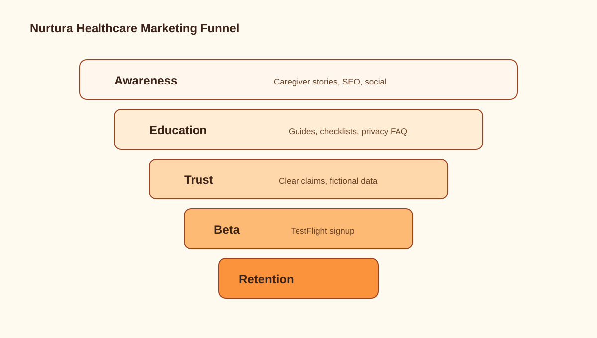

# Nurtura iOS Healthcare Marketing Guide



## Marketing Position
Nurtura is a care coordination app for families, care recipients, and
professional caregivers. The marketing should be warm, practical, and privacy
forward.

## Core Message
Care is easier when everyone knows what happened, what is next, and who needs
support.

## Messaging Pillars

### Calm Coordination
Nurtura brings care tasks, medications, schedules, messages, and notes into one
shared care hub.

### Built For Real Caregiving
Support family caregivers, professional caregivers, and care recipients with
role-aware flows and accessibility settings.

### Quick On The Wrist
Apple Watch gives caregivers lightweight access to today’s care moments without
digging through the phone.

### Privacy-First Care
Nurtura treats care information as sensitive. Marketing should never imply that
health data is used for ad targeting.

## Healthcare Marketing Rules

Do:
- Use real but non-clinical benefits: organize, remind, coordinate, log, share.
- Use caregiver empathy.
- State privacy practices plainly.
- Use fictional demo data in all creative.
- Encourage users to consult clinicians for medical decisions.

Do not:
- Claim Nurtura diagnoses or treats conditions.
- Claim medication adherence outcomes without evidence.
- Claim FDA, HIPAA, or clinical compliance unless reviewed and documented.
- Use fear-based messaging about parents or patients.
- Retarget users based on health conditions, medications, notes, or care details.

## App Store Optimization

Primary keywords:
- caregiver app
- medication reminder
- elder care
- family care
- care coordination
- home care
- Apple Watch caregiver

App name and subtitle:

```text
Nurtura
Care coordination for families
```

First three screenshot captions:
- Today’s care, clearly organized
- Medication routines without scattered notes
- A simpler way to coordinate family care

## Channel Strategy

| Channel | Role | Content |
| --- | --- | --- |
| App Store | Conversion | Screenshots, reviews, clear privacy |
| Website | Education | Landing page, FAQ, privacy, caregiver guides |
| Blog/SEO | Discovery | Caregiver checklists, medication organization, watch reminders |
| Email | Nurture | Waitlist, beta invites, launch series |
| LinkedIn | Professional caregivers | Home care coordination, team updates |
| Facebook Groups | Family caregivers | Helpful posts, no spam, community-first |
| Partnerships | Trust | Senior centers, home care agencies, caregiver coaches |
| PR | Awareness | Human story around family care coordination |

## Content Themes

1. The daily caregiver load
2. Medication routine organization
3. Sharing updates without group chat overload
4. Apple Watch as a light care companion
5. Accessibility for aging eyes and busy hands
6. Professional caregiver documentation
7. Privacy in family care apps

## Example Landing Page Copy

Headline:

```text
Care coordination, made calmer.
```

Subheadline:

```text
Nurtura helps families and caregivers organize medications, schedules, notes, and updates across iPhone and Apple Watch.
```

CTA:

```text
Join the Nurtura beta
```

Trust note:

```text
Built for care coordination. Not a substitute for medical advice.
```

## Metrics

Awareness:
- App Store impressions
- Landing page visits
- Waitlist signups
- Social saves/shares

Activation:
- Install to completed onboarding
- First care recipient created
- First medication or schedule item added
- Watch app installed and synced

Retention:
- Weekly active caregivers
- Care logs per recipient
- Reminder completion rate
- Care team messages sent

Trust:
- Privacy policy views
- Support tickets about data/privacy
- App Store rating and review themes

